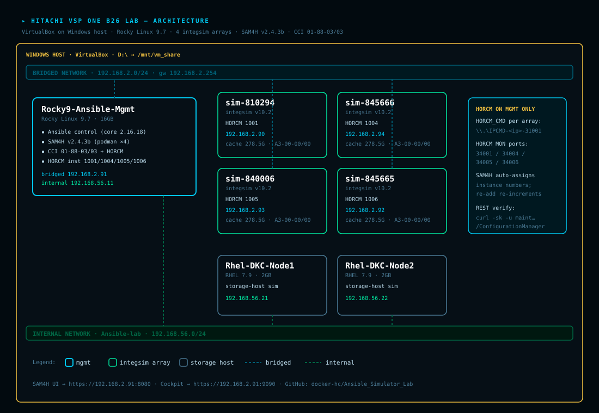
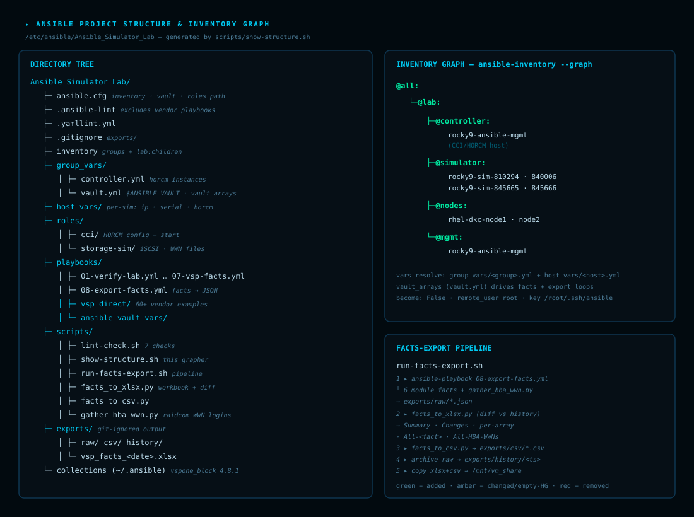
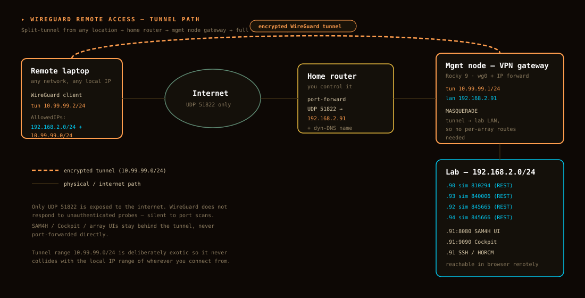

# Ansible Simulator Lab

> **Official Ansible Simulator 2024 Lab** - A comprehensive hands-on learning environment for mastering Ansible automation in Rocky Linux 9


## 📋 Overview

This lab provides a practical, hands-on simulator environment designed to teach Ansible automation principles and best practices. Built around Rocky Linux 9, it offers real-world scenarios including system access control, configuration management, production deployments, and infrastructure migration.

### What You'll Learn

- ✅ **Ansible Fundamentals** - Playbooks, roles, and inventory management
- ✅ **Access Control & Security** - User management, permissions, and SSH configuration
- ✅ **Configuration Management** - Automating system configurations and deployments
- ✅ **Production Practices** - Best practices for enterprise Ansible deployments
- ✅ **Remote Access** - Managing distributed infrastructure
- ✅ **System Migration** - Automating ESXi and infrastructure migrations
- ✅ **CI/CD Integration** - Ansible linting gates and automation pipelines
- ✅ **Advanced Topics** - Facts, extensions, and multi-model deployments

## 🏗️ Lab Architecture

This lab includes comprehensive architecture diagrams to help you understand the infrastructure setup:

### Main Architecture


### Ansible Structure


### WireGuard Topology


## 📚 Documentation

Complete HTML-based lab guides are included:

| Guide | Topic | Description |
|-------|-------|-------------|
| [Lab-Guide-Rocky9-Simulator.html](docs/Lab-Guide-Rocky9-Simulator.html) | Getting Started | Initial setup and environment configuration |
| [Lab-Guide-Rocky9-Implementation.html](docs/Lab-Guide-Rocky9-Implementation.html) | Core Implementation | Core Ansible concepts and playbook development |
| [Lab-Guide-Rocky9-RemoteAccess.html](docs/Lab-Guide-Rocky9-RemoteAccess.html) | Remote Access | Configuring and managing remote access |
| [Lab-Guide-Rocky9-AccessControl.html](docs/Lab-Guide-Rocky9-AccessControl.html) | Access Control | User management and security controls |
| [Lab-Guide-Rocky9-Production.html](docs/Lab-Guide-Rocky9-Production.html) | Production | Production-ready Ansible configurations |
| [Lab-Guide-Rocky9-ESXiMigration.html](docs/Lab-Guide-Rocky9-ESXiMigration.html) | ESXi Migration | Automating infrastructure migrations |
| [Lab-Guide-Rocky9-MultiModel.html](docs/Lab-Guide-Rocky9-MultiModel.html) | Multi-Model | Multi-model deployment patterns |
| [Lab-Guide-Rocky9-FactsExtensions.html](docs/Lab-Guide-Rocky9-FactsExtensions.html) | Facts & Extensions | Custom facts and Ansible extensions |
| [10-ci-lint-gate.html](docs/10-ci-lint-gate.html) | CI/CD | CI/CD pipelines and linting gates |
| [Lab-Guide-Rocky9-Troubleshooting.html](docs/Lab-Guide-Rocky9-Troubleshooting.html) | Troubleshooting | Common issues and solutions |

## 🚀 Quick Start

### Prerequisites

- Rocky Linux 9 or compatible environment
- Ansible 2.9+ installed
- SSH access to target hosts
- Basic Linux command-line knowledge

### Installation

1. **Clone the repository:**
   ```bash
   git clone https://github.com/docker-hc/Ansible_Simulator_Lab.git
   cd Ansible_Simulator_Lab
   ```

2. **Install dependencies:**
   ```bash
   pip install -r requirements.yml
   # or for Galaxy roles:
   ansible-galaxy install -r requirements.yml
   ```

3. **Configure your inventory:**
   ```bash
   # Edit the inventory file with your target hosts
   vim inventory
   # or
   vim hosts
   ```

4. **Run the installation script:**
   ```bash
   chmod +x install-lab-docs.sh
   ./install-lab-docs.sh
   ```

## 📁 Project Structure

```
Ansible_Simulator_Lab/
├── ansible.cfg              # Ansible configuration
├── inventory                # Inventory file with host definitions
├── hosts                    # Alternative hosts inventory
├── requirements.yml         # Galaxy role dependencies
├── docs/                    # Comprehensive lab documentation
│   ├── *.html              # HTML lab guides
│   └── *.svg               # Architecture diagrams
├── playbooks/              # Ansible playbooks
├── roles/                  # Ansible roles
├── group_vars/             # Group-level variables
├── host_vars/              # Host-level variables
├── scripts/                # Helper scripts
└── .ansible-lint           # Linting configuration
```

## 🔧 Key Features

- **Comprehensive Documentation** - 10+ detailed HTML guides covering all aspects
- **Visual Architecture Diagrams** - SVG diagrams for quick reference
- **Production-Ready Patterns** - Best practices and enterprise configurations
- **Multiple Lab Scenarios** - Access control, migrations, CI/CD, and more
- **Linting & Quality Gates** - Built-in Ansible and YAML linting
- **Multi-Model Support** - Multiple deployment and configuration patterns
- **Security Focus** - Emphasis on access control and secure configurations

## 🎯 Lab Scenarios

This simulator includes several practical lab scenarios:

1. **Access Control & Security** - Implement and manage user access, SSH keys, and permission controls
2. **System Configuration** - Automate system configuration and software deployment
3. **Production Deployments** - Best practices for deploying to production systems
4. **Infrastructure Migration** - Automate migration from ESXi and other platforms
5. **Remote Access Management** - Configure and manage remote access to systems
6. **Facts & Gathering** - Learn to use and extend Ansible facts
7. **Multi-Model Deployments** - Work with multiple deployment models and patterns

## 📖 Usage Examples

### Basic Playbook Execution
```bash
ansible-playbook playbooks/site.yml -i inventory
```

### Syntax Check
```bash
ansible-playbook playbooks/site.yml --syntax-check
```

### Lint Checking
```bash
ansible-lint playbooks/
```

### Dry Run
```bash
ansible-playbook playbooks/site.yml -i inventory --check
```

### Targeting Specific Groups
```bash
ansible-playbook playbooks/site.yml -i inventory -l webservers
```

## ✅ Linting & Quality

This project includes strict linting configurations:

- **Ansible-lint** - `.ansible-lint` / `.ansible-lint.yml`
- **YAML Lint** - `.yamllint.yml`

All contributions should pass linting checks:
```bash
ansible-lint
yamllint .
```

## 🐛 Troubleshooting

For common issues and solutions, refer to:
- [Lab-Guide-Rocky9-Troubleshooting.html](docs/Lab-Guide-Rocky9-Troubleshooting.html)

Common issues covered:
- Connection problems
- Inventory configuration issues
- Permission and access errors
- Variable resolution issues
- Module compatibility

## 🤝 Contributing

Contributions are welcome! Please:

1. Fork the repository
2. Create a feature branch (`git checkout -b feature/my-feature`)
3. Make your changes and ensure linting passes
4. Commit with clear messages
5. Push and submit a pull request

All contributions must:
- Pass `ansible-lint` checks
- Pass `yamllint` validation
- Include documentation updates
- Follow existing code patterns

## 📝 License

This project is licensed under the GNU General Public License v3.0 - see the [LICENSE](LICENSE) file for details.

## 📧 Support

For issues, questions, or suggestions:

- Open an [Issue](https://github.com/docker-hc/Ansible_Simulator_Lab/issues)
- Check [Discussions](https://github.com/docker-hc/Ansible_Simulator_Lab/discussions)
- Review the [Troubleshooting Guide](docs/Lab-Guide-Rocky9-Troubleshooting.html)

## 🔗 Resources

- [Ansible Official Documentation](https://docs.ansible.com/)
- [Rocky Linux Documentation](https://docs.rockylinux.org/)
- [Ansible Best Practices](https://docs.ansible.com/ansible/latest/tips_tricks/index.html)

## 👤 Author

**docker-hc** - [GitHub Profile](https://github.com/docker-hc)

---

**Last Updated:** June 2026 | **Status:** Active & Maintained